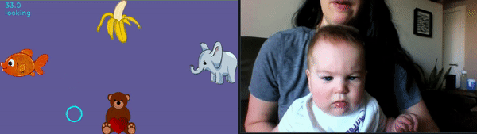

# OWLET

<div id="top"></div>
<!--
*** 
*** 
-->

<!-- PROJECT LOGO -->
<br />
<div align="center">
  <a href="https://github.com/denisemw/OWLET">
    
  </a>

<div align="left">

<!-- ABOUT THE PROJECT -->
## About The Project

<p align = “left”>Thanks for checking out our software! OWLET is designed to process infant gaze and looking behavior using webcam videos recorded on laptops or smartphones. If you use this software in your research, please cite as: <br><br> Werchan, D. M., Thomason, M. E., & Brito, N. H. (2022). OWLET: An Automated, Open-Source Method for Infant Gaze Tracking using Smartphone and Webcam Recordings. Behavior Research Methods. <br><br> Instructions for downloading and running the source code for OWLET is below. In addition, a beta version of a MacOS app to run OWLET through a user interface can be found at: https://denisewerchan.com/owlet</p>
  
  
<p align="right">(<a href="#top">back to top</a>)</p>

### User Guide
<p align = “left”>A user guide for OWLET, which describes options for processing gaze data with OWLET in more detail, can be found at: https://denisewerchan.com/owlet <br><br><br></p>  
  
  
### OWLET was built using Python v. 3.8.8. with 

* [opencv]( https://pypi.org/project/opencv-python/)
* [dlib]( http://dlib.net)
* [numpy]( https://numpy.org/)
* [pandas]( https://pandas.pydata.org/)
* [scipy]( https://scipy.org/)
* [librosa]( https://librosa.org/doc/latest/index.html/)

<p align="right">(<a href="#top">back to top</a>)</p>


<!-- GETTING STARTED -->
## Getting Started

### 1. Install miniconda following the directions [here](https://docs.conda.io/projects/miniconda/en/latest/miniconda-install.html)

### 2. Install OWLET by cloning the GitHub repository using the following Terminal command:

   ```sh
   git clone https://github.com/denisemw/OWLET.git
   ```
### 3. Navigate to the OWLET directory and install the required dependenices by either:

* Using conda and creating a virtual environment using the owlet_environment.yml file in the repository (recommended):
  
   ```sh
   conda env create -n owlet_env -f owlet_environment.yml
   conda activate owlet_env
   ```
* Installing the required dependencies manually using pip install (if the above option fails):
 ```sh
   pip install opencv-python
   pip install dlib
   pip install numpy
   pip install pandas
   pip install librosa
   pip install scipy
   ```
<p align="right">(<a href="#top">back to top</a>)</p>

<!-- SETTING UP YOUR EXPERIMENT FOR OWLET -->
## Setting up your experiment for OWLET

### 1. Create a directory with the subject videos

Create a directory that contains your subject video(s) and the optional corresponding calibration video(s).

* If calibration files are inlcuded in the directory, they should have the same name as the subject videos with ‘_calibration’ added at the end

* If calibration files are not included in the same directory, OWLET will process the videos using default settings.
  

### 2. (optional) Create a directory with the task information

This step is optional, but will allow you to automatically link the frame-by-frame eye tracking data with information about the task. To do this, create a folder(s) that specifies optional information for each task(s):

A video of the task in .mov or .mp4 format (maximum frame rate of 30 fps)
* If this is included, OWLET will save a video of the subject's point-of-gaze overlayed on the task video in addition to the frame-by-frame csv output

A csv file with trial timings
* If this is included, OWLET will tag the start of each trial in the frame-by-frame csv output 

A csv file with x/y areas of interest (AOIs)
* If this is included, OWLET will tag which AOI that the baby’s point-of-gaze was in for each video frame in the csv output; if custom AOIs are not included, the csv output will only tag whether the baby is looking at the left, right, or away from the screen for each video frame


<p align="right">(<a href="#top">back to top</a>)</p>
  
  <!-- RUNNING OWLET -->
## Running OWLET using Terminal commands

#### Before running OWLET, navigate to the directory where you installed OWLET and make sure the virtual environment is activated (if used).

#### To analyze a child's frame-by-frame gaze coordinates for the entire video recording, use the following:
```sh
   python owlet.py /path/to/subject/video.mp4
   ```
  
#### To automatically link the frame-by-frame gaze output with information about the task, include the '--experiment_info' option:
  
  ```sh
   python OWLET.py /path/to/subject/video --experiment_info /path/to/experiment/folder
   ```

### Additional tips

When task information is included using the '--experiment_info' option, OWLET will automatically find where the task began in the recorded video of the child by matching the audio patterns in the subject and task videos. This is helpful for automating processing, as it removes the need to manually trim the recordings. However, this can fail occasionally when an audio match is not found (e.g., if the subject video or task video does not contain sound). If you have issues with audio matching but still wish to automatically link the subject recordings with task information, follow these steps:

1. Manually trim the subject recording so that only the task of interest is in the video.
2. Run OWLET using the '--override_audio_matching' option:
   * python OWLET.py /path/to/subject/video --experiment_info /path/to/experiment/folder --override_audio_matching

<p align="right">(<a href="#top">back to top</a>)</p>

<!-- USAGE EXAMPLES -->
## Usage

Below is an example of a Zoom video processed using OWLET.<br><br>
  
<div align="center">
<h3 >OWLET Demo:</h3>
<a href="https://github.com/denisemw/OWLET">
    
  </a>
<div align="left">

<p align="right">(<a href="#top">back to top</a>)</p>


<!-- BEST PRACTICES -->
## Best Practices and Helpful Tips

OWLET works best with high quality videos, and some tips are shown below. In addition, you can alter videos in editing software (e.g., iMovie) to change the contrast/brightness or crop in on the subject’s face, which can improve performance for poor quality videos. <br><br>
<div align="center">
<h3 >Tips for Recording Videos:</h3>
<a href="https://github.com/denisemw/OWLET/">
    
  </a>

<div align="left">

<p align="right">(<a href="#top">back to top</a>)</p>

<!-- LICENSE -->
## License

Distributed under the GNU General Public License v3.0. See `LICENSE` for more information.

<p align="right">(<a href="#top">back to top</a>)</p>

<!-- CONTACT -->
## Contact

Denise Werchan - [denisewerchan.com](https://denisewerchan.com) – [@DeniseWerchan](https://twitter.com/DeniseWerchan) – denise.werchan@nyulangone.org

Project Link: [https://github.com/denisemw/OWLET](https://github.com/denisemw/OWLET)

<p align="right">(<a href="#top">back to top</a>)</p>


<!-- MARKDOWN LINKS & IMAGES -->
<!-- https://www.markdownguide.org/basic-syntax/#reference-style-links -->
[contributors-shield]: https://img.shields.io/github/contributors/denisemw/OWLET.svg?style=for-the-badge
[contributors-url]: https://github.com/denisemw/OWLET/graphs/contributors
[forks-shield]: https://img.shields.io/github/forks/denisemw/OWLET.svg?style=for-the-badge
[forks-url]: https://github.com/denisemw/OWLET/network/members
[stars-shield]: https://img.shields.io/github/stars/denisemw/OWLET.svg?style=for-the-badge
[stars-url]: https://github.com/denisemw/OWLET/stargazers
[issues-shield]: https://img.shields.io/github/issues/denisemw/OWLET.svg?style=for-the-badge
[issues-url]: https://github.com/denisemw/OWLET/issues
[license-shield]: https://img.shields.io/github/license/denisemw/OWLET.svg?style=for-the-badge
[license-url]: https://github.com/denisemw/OWLET/blob/master/LICENSE.txt
[linkedin-shield]: https://img.shields.io/badge/-LinkedIn-black.svg?style=for-the-badge&logo=linkedin&colorB=555
[linkedin-url]: https://linkedin.com/in/denise-werchan
[product-screenshot]: Images/owlet_logo.png
</p>
    
