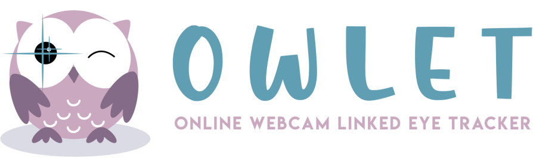
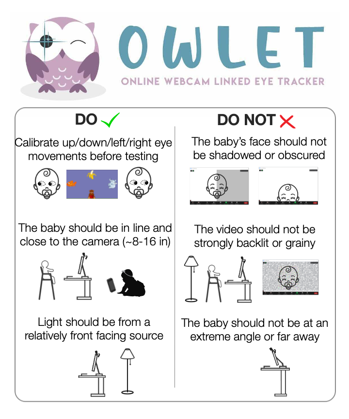

# OWLET

<div id="top"></div>
<!--
*** 
*** 
-->

<!-- PROJECT LOGO -->
<br />
<div align="center">
  <a href="https://github.com/denisemw/OWLET">
    
  </a>

<div align="left">

<!-- ABOUT THE PROJECT -->
## About The Project

<p align = “left”>Thanks for checking out our software! OWLET is designed to process infant gaze and looking behavior using webcam videos recorded on laptops or smartphones. If you use this software in your research, please cite as: <br><br> Werchan, D. M., Thomason, M. E., & Brito, N. H. (2022). OWLET: an open-source, robust, and scalable method for infant webcam eye tracking. </p>

<p align="right">(<a href="#top">back to top</a>)</p>


### Built using Python v. 3.8.8. with 

* [opencv]( https://pypi.org/project/opencv-python/)
* [dlib]( http://dlib.net)
* [numpy]( https://numpy.org/)
* [pandas]( https://pandas.pydata.org/)
* [scipy]( https://scipy.org/)
* [librosa]( https://librosa.org/doc/latest/index.html/)

<p align="right">(<a href="#top">back to top</a>)</p>


<!-- GETTING STARTED -->
## Getting Started

To get a local copy of this software up and running follow these steps:

First, install the above packages using pip or conda install:
  ```sh
pip install opencv-python dlib numpy pandas scipy librosa
  ```

Second, download or clone the repo:
   ```sh
   git clone https://github.com/denisemw/OWLET.git
   ```
<p align="right">(<a href="#top">back to top</a>)</p>


<!-- USAGE EXAMPLES -->
## Usage

Below is an example of a Zoom video processed using OWLET.<br><br>
  
<div align="center">
<h3 >OWLET Demo:</h3>
<a href="https://github.com/denisemw/OWLET">
    
  </a>
<div align="left">

<p align="right">(<a href="#top">back to top</a>)</p>


<!-- BEST PRACTICES -->
## Best Practices and Helpful Tips

OWLET works best with high quality videos, and some tips are shown below. In addition, you can alter videos in editing software (e.g., iMovie) to change the contrast/brightness or crop in on the subject’s face, which can improve performance for poor quality videos. <br><br>
<div align="center">
<h3 >Tips for Recording Videos:</h3>
<a href="https://github.com/denisemw/OWLET">
    
  </a>

<div align="left">

<p align="right">(<a href="#top">back to top</a>)</p>

<!-- LICENSE -->
## License

Distributed under the GNU General Public License v3.0. See `LICENSE` for more information.

<p align="right">(<a href="#top">back to top</a>)</p>

<!-- CONTACT -->
## Contact

Denise Werchan - [denisewerchan.com](https://denisewerchan.com) – [@DeniseWerchan](https://twitter.com/DeniseWerchan) – denise.werchan@nyulangone.org

Project Link: [https://github.com/denisemw/OWLET](https://github.com/denisemw/OWLET)

<p align="right">(<a href="#top">back to top</a>)</p>


<!-- MARKDOWN LINKS & IMAGES -->
<!-- https://www.markdownguide.org/basic-syntax/#reference-style-links -->
[contributors-shield]: https://img.shields.io/github/contributors/denisemw/OWLET.svg?style=for-the-badge
[contributors-url]: https://github.com/denisemw/OWLET/graphs/contributors
[forks-shield]: https://img.shields.io/github/forks/denisemw/OWLET.svg?style=for-the-badge
[forks-url]: https://github.com/denisemw/OWLET/network/members
[stars-shield]: https://img.shields.io/github/stars/denisemw/OWLET.svg?style=for-the-badge
[stars-url]: https://github.com/denisemw/OWLET/stargazers
[issues-shield]: https://img.shields.io/github/issues/denisemw/OWLET.svg?style=for-the-badge
[issues-url]: https://github.com/denisemw/OWLET/issues
[license-shield]: https://img.shields.io/github/license/denisemw/OWLET.svg?style=for-the-badge
[license-url]: https://github.com/denisemw/OWLET/blob/master/LICENSE.txt
[linkedin-shield]: https://img.shields.io/badge/-LinkedIn-black.svg?style=for-the-badge&logo=linkedin&colorB=555
[linkedin-url]: https://linkedin.com/in/denise-werchan
[product-screenshot]: owlet_logo.png
</p>
    
